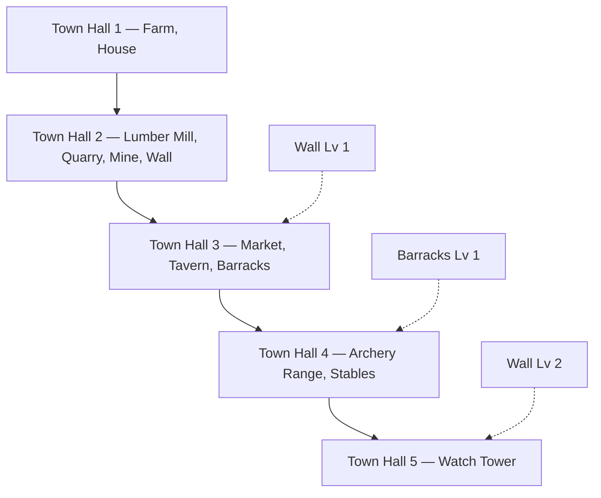

# Cycle of Kings (Medieval Empires)

A medieval town-building strategy game: **Expo mobile app** + **Express API** + **PostgreSQL**.

Build your town, command armies, raid rivals, and climb the seasonal leaderboard.

## Prerequisites

- [Node.js](https://nodejs.org/) 20+ (22 or 24 recommended)
- [pnpm](https://pnpm.io/) 10+
- [Docker](https://www.docker.com/) (for PostgreSQL)
- [Expo Go](https://expo.dev/go) on your phone, or iOS Simulator / Android Emulator

## Quick start

```bash
# 1. Install dependencies
pnpm install

# 2. Environment
cp .env.example .env

# 3. Start PostgreSQL
pnpm db:up

# 4. Apply database schema
pnpm db:push

# 5. API + mobile (one command), or use two terminals with dev:api / dev:mobile
pnpm dev
```

Or run separately:

```bash
pnpm dev:api    # terminal 1
pnpm dev:mobile # terminal 2
```

Open the Expo dev tools (press `i` for iOS Simulator, `a` for Android emulator, or scan the QR code with Expo Go).

### API URL on devices

The mobile app calls the API using `EXPO_PUBLIC_API_URL` from `.env`:

| Target | `EXPO_PUBLIC_API_URL` |
|--------|------------------------|
| iOS Simulator / web | `http://localhost:8080` |
| Android emulator | `http://localhost:8080` (auto-rewritten to `10.0.2.2`) |
| Physical phone (same Wi‑Fi) | `http://<your-computer-lan-ip>:8080` |

In dev, `localhost` in `.env` is rewritten for Android automatically. Check the Metro log for `[api] base URL: ...` after reload.

Restart Expo after changing `.env` (`r` in the terminal or restart `pnpm dev:mobile`). Restart the dev server after changing `app.json` (cleartext HTTP on Android).

Health check: [http://localhost:8080/api/healthz](http://localhost:8080/api/healthz)

Postgres is exposed on host port **5433** (not 5432) so it does not clash with an existing local PostgreSQL install. If you prefer `5432`, change the port mapping in `docker-compose.yml` and update `DATABASE_URL` in `.env`.

## Project structure

```
artifacts/
  mobile/          # Expo SDK 54 app (expo-router)
  api-server/      # Express 5 API (bundled with esbuild)
lib/
  api-spec/        # OpenAPI spec → Orval codegen
  api-client-react/# Generated React Query hooks
  api-zod/         # Generated Zod schemas
  db/              # Drizzle ORM + PostgreSQL schema
  building-progression/  # Town Hall gates + building prerequisites (shared by API + mobile)
```

## Building progression

First-time builds are gated by **Town Hall level** and a few building prerequisites. Upgrades only cost resources (once built). Rules live in `lib/building-progression/src/index.ts` and are enforced on the API and shown in the mobile building list.



| Town Hall | Unlocks (first build) | Also requires |
|-----------|------------------------|---------------|
| 1 | Town Hall (Lv 1), Farm, House | — |
| 2 | Lumber Mill, Quarry, Mine, Town Wall | — |
| 3 | Market, Tavern, Barracks | Wall Lv 1 |
| 4 | Archery Range, Stables | Barracks Lv 1 |
| 5 | Watch Tower | Wall Lv 2 |

Optional Replit artifact (not required locally): `artifacts/mockup-sandbox/` (web UI mockup).

## Monorepo (pnpm + Turborepo)

This repo is a [pnpm workspace](https://pnpm.io/workspaces) orchestrated with [Turborepo](https://turbo.build/). Turbo caches task outputs and runs packages in dependency order (`^typecheck` runs upstream libs before apps).

## Common commands

| Command | Description |
|---------|-------------|
| `pnpm install` | Install all workspace packages |
| `pnpm db:up` | Start Postgres via Docker Compose |
| `pnpm db:down` | Stop Postgres |
| `pnpm db:push` | Push Drizzle schema to the database |
| `pnpm dev` | Run API + mobile dev servers in parallel |
| `pnpm dev:api` | Build and run API on port 8080 |
| `pnpm dev:mobile` | Start Expo dev server |
| `pnpm typecheck` | Typecheck all packages (cached) |
| `pnpm build` | Build API server bundle (cached) |
| `pnpm build:mobile` | Production Expo static build (Replit deploy; needs domain env) |
| `pnpm codegen` | Regenerate API client + Zod from OpenAPI, then typecheck |
| `pnpm typecheck --filter=@workspace/mockup-sandbox` | Typecheck the optional web mockup only |

## Development notes

- API routes are mounted at `/api` (e.g. `/api/players`, `/api/towns`).
- After changing `lib/api-spec/openapi.yaml`, run `pnpm codegen`.
- After changing `lib/db/src/schema/*`, run `pnpm db:push`.
- Players are identified by a device UUID in AsyncStorage (no auth in MVP).
- Game design and architecture details: [replit.md](./replit.md).

## Environment variables

| Variable | Required | Description |
|----------|----------|-------------|
| `DATABASE_URL` | Yes (API, db push) | PostgreSQL connection string |
| `PORT` | Yes (API) | API listen port (default `8080`) |
| `EXPO_PUBLIC_API_URL` | Yes (mobile) | API base URL for the Expo app |
| `EXPO_PUBLIC_DOMAIN` | Replit only | HTTPS domain when hosted on Replit |
